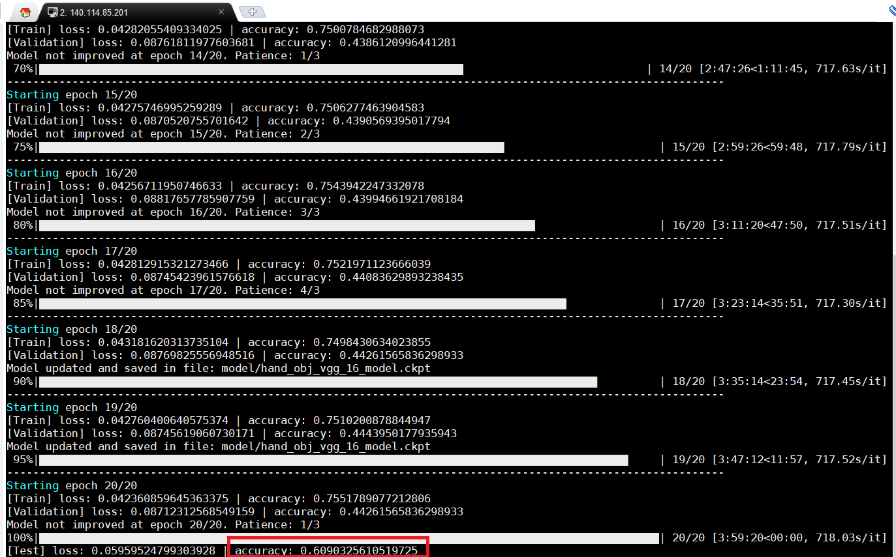

# 靳文綺 (106062563)

#Homework 1: Object Classification

## Overview
I used VGG-16 model with pre-trained model to implement this project about object classification with TensorFlow.

## Environment
* OS: Ubuntu 16.04.2 LTS
* Anaconda (version 1.6.3)
* GPU: Nvidia GeForce GTX TITAN X
* Cuda 8.0
* Python 3.6.2

## Installation
* tensorflow
* tensorflow.contrib.slim
* numpy
* tqdm

## Implementation
1. Load data
- [`data_loader.py`]: This code is for loading training, validation, and testing data. The data size is large, so I resized the data and named dataset. Because this homework just want to classify the object captured by HandCam, some images we won't use. So we can take them off.

2. Train with VGG-16 network
- [`train_vgg_16.py`]:I download the pre-trained model of VGG-16 (vgg_16.ckpt) to use. After downloading, I put this model in folder model/. The architecture of our model is same as standard VGG-16. I remove the last fully connected layer and replace it with our own. The output size is 24 (object categories).

## Results
### The accuracy of object classification.
<table border=1>
<tr>
The testing accuracy is 60.9%
</tr>

<tr>

</tr>
</table>

